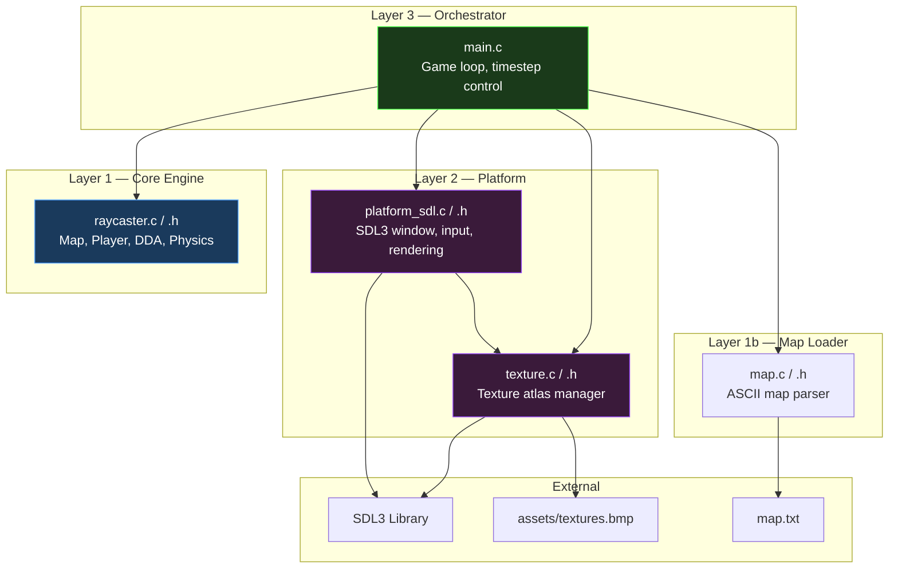
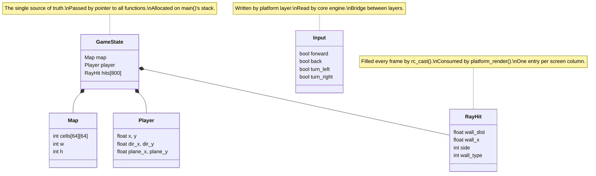

# Architecture Guide

> A deep-dive into how this raycaster works, written for junior engineers who want to understand every layer — from the game loop to the pixels on screen.

## Table of Contents

- [High-Level Overview](#high-level-overview)
- [Tech Stack & Rationale](#tech-stack--rationale)
- [The Three-Layer Architecture](#the-three-layer-architecture)
- [Data Flow: One Frame, Start to Finish](#data-flow-one-frame-start-to-finish)
- [Core Algorithm: DDA Raycasting](#core-algorithm-dda-raycasting)
- [The Fixed-Timestep Game Loop](#the-fixed-timestep-game-loop)
- [Platform Abstraction Layer](#platform-abstraction-layer)
- [Map System](#map-system)
- [Key Data Structures](#key-data-structures)

---

## High-Level Overview

This project is a **3D-style raycasting engine** — it fakes 3D by casting one ray per screen column from the player's viewpoint, measuring the distance to the nearest wall, and drawing a vertical strip whose height is inversely proportional to that distance. The result is a convincing first-person perspective rendered entirely in 2D math.

The design pattern is the **Layered Architecture** (sometimes called Ports & Adapters / Hexagonal at its conceptual root): the core game logic knows nothing about SDL, windows, or pixels. A thin platform layer translates between the engine and the OS.



---

## Tech Stack & Rationale

| Technology | Role | Why This Choice |
|---|---|---|
| **C (C11)** | Language | Raycasting is a fundamentally low-level algorithm — pointer arithmetic, fixed-size arrays, tight loops. C11 is simple and gives direct control with zero runtime overhead. |
| **SDL3** | The default frontend for the game; handling windowing, input, rendering | The de facto standard for cross-platform multimedia in C. SDL provides a 2D renderer, keyboard state polling, and high-resolution timers. SDL3 (not SDL2) is used here for its modernized API. |
| **GNU Make** | Build system | Extremely lightweight for a simple C project. No boilerplate or generator steps, easy to package. Optimised for simple text editors and CLI. The `Makefile` handles Linux, macOS, and Windows cross-compilation. |
| **pkg-config** | Dependency discovery | Locates headers and libraries portably. Avoids hardcoded paths. |
| **`-Wall -Wextra -O2`** | Compiler discipline | Maximum warnings catch bugs at compile time. `-O2` ensures the tight raycasting loop runs at full speed even on modest hardware. |

---

## The Three-Layer Architecture

### Layer 1: Core Engine (`raycaster.c` / `raycaster.h`)

**Design pattern: Pure Computation Module** — this file has zero platform dependencies. It includes `math.h` and `stdio.h`. That's it. No SDL or non-standard headers.

Responsibilities:
- **Player physics** (`rc_update`) — movement, rotation, collision detection
- **Raycasting** (`rc_cast`) — DDA algorithm fills the `RayHit` buffer

### Map Loader (`map.c` / `map.h`)

**Design pattern: File Parser Module** — separated from the core engine to allow test-time substitution with a fake implementation.

Responsibilities:
- **Map loading** (`map_load`) — parse the ASCII map file into the `Map` grid and initialise the `Player` position and camera

For unit tests, `fake_map.c` provides an alternative `map_load` implementation that returns a hardcoded map with all cell types, removing filesystem dependencies from the core test suite.

This separation is an important architectural decision in the project. It means:
- The core engine can be unit-tested without a display
- The renderer can be swapped (OpenGL, Vulkan, terminal) without touching game logic
- The math is portable to any platform with a C compiler

### Layer 2: Platform Abstraction (`platform_sdl.c` / `platform_sdl.h`)

**Design pattern: Adapter** — translates between the engine's data structures and SDL3's API.

Responsibilities:
- Window creation and teardown
- Keyboard state polling (continuous, not event-based — critical for smooth movement)
- Rendering: converts the `RayHit[]` buffer into textured vertical strips using a streaming framebuffer

The platform layer **reads from** the core but never writes to it, except through the `Input` struct. Data flows in one direction.

### Texture Manager (`texture.c` / `texture.h`)

**Design pattern: Asset Manager** — loads and provides pixel-level access to wall textures.

Responsibilities:
- Load a horizontal texture atlas (BMP) containing `TEX_COUNT` (10) square textures of `TEX_SIZE` (64) pixels each
- Provide `tm_get_pixel(wall_type, tex_x, tex_y)` for colour sampling
- Fall back to a solid wall colour (`COL_WALL`) if the BMP file is missing

The texture manager uses SDL for BMP loading but stores pixel data in a flat array for fast access. The renderer calls `tm_get_pixel()` to sample textures — it never accesses the texture data directly. This keeps the renderer decoupled from file-loading logic.

### Layer 3: Orchestrator (`main.c`)

**Design pattern: Mediator / Composition Root** — owns the game loop, wires the other two layers together, and manages time.

Responsibilities:
- Initialize subsystems in order (map → platform)
- Run the fixed-timestep loop
- Shut down cleanly on exit


---

## Data Flow: One Frame, Start to Finish

Here's what happens every single frame, in order:


Key insight: **physics and rendering are decoupled**. Physics runs at a fixed 60Hz regardless of display refresh rate. Rendering happens once per frame at whatever rate the display allows. This is the accumulator pattern.

---

## Core Algorithm: DDA Raycasting

DDA (Digital Differential Analyzer) is the heart of the engine. For each of the 800 screen columns, a ray is cast from the player's position into the map:

### Step-by-Step

1. **Compute ray direction** — Combine the player's direction vector with the camera plane, scaled by the column's position on screen (`cam_x` ranges from -1.0 to +1.0):
   ```
   ray_dir = player.dir + player.plane * cam_x
   ```

2. **Initialize DDA** — Calculate `delta_dist` (how far the ray must travel to cross one full grid cell) and `side_dist` (distance from the player to the first grid boundary) for each axis.

3. **Step through the grid** — Advance to whichever axis boundary is closer. Repeat until a wall cell is hit or the ray exits the map.

4. **Calculate perpendicular distance** — Not the Euclidean distance (that would cause fish-eye distortion), but the perpendicular distance to the camera plane:
   ```
   perp_dist = (hit_cell - player_pos + (1 - step) * 0.5) / ray_dir
   ```

5. **Store the result** — Distance, which side was hit (x or y), and the wall type go into `gs->hits[column]`.


### Why Perpendicular Distance?

If you used the actual Euclidean distance from player to wall, walls at the edges of the screen would appear curved (the "fish-eye" effect). By projecting onto the camera plane, walls render as straight lines — which is what the human eye expects.

### Side Shading

When a ray hits a wall on its Y-side (north/south face), the renderer uses `COL_WALL_SHADE` (slightly darker). This simple trick gives a strong sense of 3D depth with zero computational cost.

---

## The Fixed-Timestep Game Loop

The game loop in `main.c` implements the **fixed-timestep with accumulator** pattern. This is the industry-standard approach for decoupling physics from rendering.

```
while running:
    frame_time = time_since_last_frame()
    clamp(frame_time, max=0.25s)        ← prevents "spiral of death"
    accumulator += frame_time

    poll_input()

    while accumulator >= DT:            ← DT = 1/60s
        update_physics(DT)
        accumulator -= DT

    cast_rays()
    render()
```

### Why Not Just Use Frame Delta?

If you pass the raw frame delta to physics (`update(frame_dt)`), behavior changes at different frame rates: a 30fps machine gets different physics than a 144fps machine. Floating-point precision issues accumulate differently. Collisions can be missed at low frame rates.

The fixed-timestep approach guarantees that **physics always steps at exactly 1/60th of a second**, regardless of rendering speed. The accumulator handles the mismatch:
- If rendering is fast (144fps): multiple render frames may occur between physics steps
- If rendering is slow (30fps): multiple physics steps run per render frame

### The 250ms Clamp

```c
if (frame > 0.25f) frame = 0.25f;
```

This prevents the "spiral of death": if the game freezes (e.g., during a window drag), `frame` could become very large, causing dozens of physics updates in one burst. The clamp limits catch-up to at most ~15 ticks, keeping the game responsive after a stall.

---

## Platform Abstraction Layer

### Input Model: Continuous State, Not Events

The input system uses `SDL_GetKeyboardState()` — a snapshot of which keys are currently held — rather than processing individual key-down/key-up events. This is a deliberate design choice:

- **Events** are good for discrete actions (menu selection, chat input)
- **Continuous state** is good for movement (hold W to walk forward)

Events are still polled for quit/escape detection, but movement reads from the state array every frame.

### Rendering Pipeline

The renderer uses a streaming framebuffer texture for pixel-level textured wall rendering:

1. **Lock** the streaming framebuffer texture for direct pixel writes
2. **Fill** the framebuffer with ceiling (top half) and floor (bottom half) colours
3. **Draw walls** — for each of 800 columns:
   - Calculate strip height from `hits[x].wall_dist`
   - Derive `tex_x` from `hits[x].wall_x` (fractional hit position on the wall face)
   - For each pixel in the strip, compute `tex_y` from the vertical position
   - Sample the colour from `tm_get_pixel(wall_type, tex_x, tex_y)`
   - Apply y-side darkening for depth cue (halve RGB components)
4. **Unlock** and blit the framebuffer to the renderer
5. **Debug overlay** — player coordinates rendered as text (top-left corner)
6. **Present** — flip the back buffer to screen

### State Management

Platform state (`SDL_Window*`, `SDL_Renderer*`) is stored in **file-scoped static variables** — essentially a singleton. This is appropriate because:
- There is exactly one window and one renderer
- The platform layer is not reentrant
- The API surface is small (4 functions)

---

## Map System

Maps are ASCII text files parsed at startup. The format is simple by design:

```
XXXXXXXXXXXXXXXX
X              X
X  XXXXX  XXX  X
X  X          XX
X  X  XXXXXX  X
X     X    X   X
X  P  X    X   X      ← P marks player spawn
X     X        X
XXXX  XXXX  XXXX
...
```

| Character | Meaning | Cell Value |
|---|---|---|
| `X` or `#` | Wall (texture 0) | `1` |
| `0`–`9` | Wall (texture N) | `N + 1` |
| `P` or `p` | Player spawn (floor) | `0` |
| `F` or `f` | Exit trigger (floor) | `-1` (`CELL_EXIT`) |
| ` ` (space) | Empty floor | `0` |

Cell values encode wall presence, texture type, and special floor types: `0` = floor, `>= 1` = wall with `wall_type = cell - 1`, `< 0` = special floor (e.g. `CELL_EXIT`). `is_wall()` checks `> 0` so negative values are walkable. When the player steps on a `CELL_EXIT` cell, `game_over` is set to `true` and the game displays a congratulations screen.

Constraints:
- Maximum size: 64×64 (`MAP_MAX_W` / `MAP_MAX_H`)
- Must contain exactly one `P` (parser uses the last one found if multiple exist)
- Edges should be walled off (out-of-bounds is treated as wall, but open edges look wrong)

The player spawns at the **center** of the `P` cell (`col + 0.5, row + 0.5`) facing east, with the camera plane derived from `FOV_DEG`.

---

## Key Data Structures



### Ownership Model

- `GameState` is the **single source of truth** — allocated on `main()`'s stack, passed by pointer everywhere
- `Input` is the **bridge** — written by the platform layer, read by the core engine
- `RayHit[SCREEN_W]` is the **frame buffer** — filled by `rc_cast()`, consumed by `platform_render()`
- Platform state (window, renderer) is **private** to `platform_sdl.c` via file-scoped statics

No heap allocation. No global mutable state (except the platform singletons). No dynamic arrays. This is a codebase where you can trace every byte's lifetime by reading the code.
