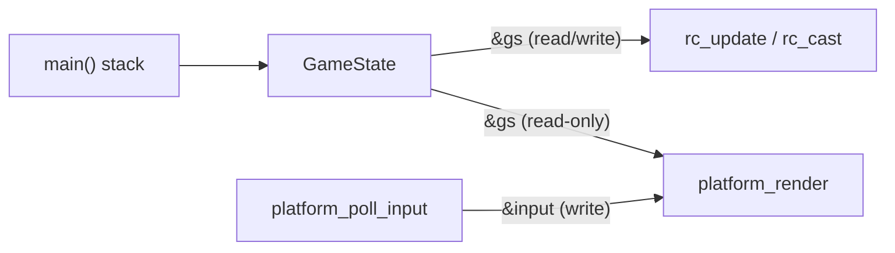

# Coding Conventions Guide

> The rules this codebase follows — and should continue to follow. If you're contributing, read this first.

## Table of Contents

- [Naming Conventions](#naming-conventions)
- [File Organization](#file-organization)
- [Formatting & Style](#formatting--style)
- [Error Handling Strategy](#error-handling-strategy)
- [State Management Rules](#state-management-rules)
- [Memory Management](#memory-management)
- [Testing Patterns](#testing-patterns)
- [Collision & Physics Conventions](#collision--physics-conventions)
- [Inconsistencies & Recommended Standards](#inconsistencies--recommended-standards)

---

## Naming Conventions

### Function Prefixes

Functions are namespaced by their layer using prefixes. This is the C equivalent of modules.

| Prefix | Layer | Examples |
|---|---|---|
| `rc_` | Core raycasting engine | `rc_load_map`, `rc_update`, `rc_cast` |
| `platform_` | SDL3 platform abstraction | `platform_init`, `platform_shutdown`, `platform_poll_input`, `platform_render` |
| *(none)* | `main()` and static helpers | `main`, `is_wall` (static in raycaster.c), `rgba` (static in platform_sdl.c) |

**Rule:** Every public function must carry its layer prefix. Static (file-private) helper functions do not need a prefix.

### Variables

- **Descriptive names** for domain concepts: `wall_dist`, `draw_start`, `line_h`, `cam_x`
- **Short names** only for well-understood math: `c`/`s` for cos/sin, `dx`/`dy` for deltas, `p` for player pointer, `m` for map pointer
- **Struct members** use `snake_case`: `dir_x`, `plane_y`, `wall_type`, `strafe_left`

### Constants

- **Preprocessor defines** in `UPPER_SNAKE_CASE`: `SCREEN_W`, `FOV_DEG`, `MAP_MAX_H`, `COL_WALL`
- **Color constants** prefixed with `COL_`: `COL_CEIL`, `COL_FLOOR`, `COL_WALL`, `COL_WALL_SHADE`
- **Physics constants** use descriptive suffixes: `MOVE_SPD`, `ROT_SPD`, `TICK_RATE`

### Types

- **Typedef'd structs** in `PascalCase`: `GameState`, `Player`, `Map`, `RayHit`, `Input`
- No `_t` suffix (avoids conflict with POSIX reserved names)

---

## File Organization

### Header Files

Every `.c` file has a corresponding `.h` file (except `main.c`). Headers follow this structure:

```c
#ifndef RAYCASTER_H          // Include guard: FILENAME_H
#define RAYCASTER_H

#include <stdbool.h>          // Standard library includes first

/* Section comments */
// Type definitions
// Function declarations with doc comments

#endif /* RAYCASTER_H */      // Closing comment repeats guard name
```

### Source Files

Each `.c` file opens with a comment block identifying its purpose:

```c
/*  filename.c  –  one-line description
 *  ───────────────────────────────────
 *  Optional longer explanation.
 */
```

Include order:
1. Own header (`#include "raycaster.h"`)
2. Other project headers
3. System/library headers (`<math.h>`, `<SDL3/SDL.h>`)

### Section Comments

Logical blocks within a file are separated by box-drawing section headers:

```c
/* ── Section Name ──────────────────────────────────────────────────── */
```

These use the `──` (U+2500) box-drawing character, not ASCII dashes. The line extends to column 72. This is a consistent visual convention throughout the codebase — **do not use plain `//` or `/* --- */` style separators**.

---

## Formatting & Style

### Language Standard

- **C11** (`-std=c11`), enforced by the Makefile
- `bool` via `<stdbool.h>` (not `int` for boolean values)
- No C++ features, no compiler extensions (GNU or otherwise)

### Indentation & Braces

- **4-space indentation** (no tabs in source files)
- **K&R brace style** for functions:
  ```c
  bool rc_load_map(GameState *gs, const char *path)
  {
      // body
  }
  ```
- **Egyptian braces** for control flow:
  ```c
  if (condition) {
      // body
  } else {
      // body
  }
  ```
- **Single-line bodies** allowed without braces for simple if/return:
  ```c
  if (mx < 0 || my < 0 || mx >= m->w || my >= m->h) return true;
  ```

### Alignment

Deliberate column-alignment is used for related declarations:

```c
float dir_x, dir_y;          /* direction vector                  */
float plane_x, plane_y;      /* camera plane (perpendicular)      */
```

```c
in->forward      = ks[SDL_SCANCODE_W] || ks[SDL_SCANCODE_UP];
in->back         = ks[SDL_SCANCODE_S] || ks[SDL_SCANCODE_DOWN];
in->strafe_left  = ks[SDL_SCANCODE_A];
in->strafe_right = ks[SDL_SCANCODE_D];
```

This visual alignment is intentional and should be maintained when adding new fields.

### Comments

- **Inline comments** on the right, column-aligned: `/* description */`
- **Doc comments** above function declarations in headers: `/** Brief description. */`
- **No Doxygen or Javadoc** — the codebase uses plain C comments
- Comment the *why*, not the *what* — the code is straightforward enough that most lines are self-documenting

### Compiler Warnings

```makefile
CFLAGS = -std=c11 -Wall -Wextra -O2
```

**Rule: Zero warnings.** The codebase compiles cleanly with `-Wall -Wextra`. Unused parameters are silenced explicitly:

```c
(void)argc; (void)argv;
```

---

## Error Handling Strategy

The codebase uses a **fail-fast, propagate-boolean** strategy. There are no exceptions (it's C), no error codes, and no `errno` inspection.

### Pattern: Return `bool`, Print to `stderr`

```c
bool rc_load_map(GameState *gs, const char *path)
{
    FILE *fp = fopen(path, "r");
    if (!fp) {
        fprintf(stderr, "rc_load_map: cannot open '%s'\n", path);
        return false;
    }
    // ...
}
```

Every error message includes the **function name** and the **offending value** for debuggability.

### Caller Responsibility

```c
if (!rc_load_map(&gs, map_path)) {
    fprintf(stderr, "Failed to load map '%s'\n", map_path);
    return 1;
}

if (!platform_init("Raycaster – SDL3")) {
    return 1;    // platform_init already printed the SDL error
}
```

**Rule:** The callee prints the specific diagnostic. The caller decides whether to continue or abort.

### What's NOT Handled

- No recovery from SDL failures (renderer creation, etc.) — the program exits
- No graceful degradation — if the map is missing, the game doesn't start
- No runtime assertions or `assert()` usage

This is appropriate for a small game. For a larger project, consider adding `assert()` for invariants in debug builds.

---

## State Management Rules

### Single Source of Truth

`GameState` is the entire world. It lives on `main()`'s stack and is passed by pointer to every function that needs it.



**Rules:**
1. `GameState` is never copied — always passed by pointer
2. Only `rc_update` and `rc_cast` mutate `GameState`
3. `platform_render` receives `const GameState *` — it is read-only
4. `Input` flows one way: platform writes it, core reads it

### No Global Mutable State (in the core)

`raycaster.c` has zero global or file-scoped variables. All state is in the `GameState` struct.

`platform_sdl.c` has two file-scoped statics (`window`, `renderer`). This is the one exception, and it's encapsulated behind the platform API — no other file can access them.

### Initialization

All structs are zero-initialized before use:

```c
GameState gs;
memset(&gs, 0, sizeof(gs));

Input input;
memset(&input, 0, sizeof(input));
```

**Rule:** Never leave a struct partially initialized. Use `memset` to zero the entire struct, then set specific fields.

---

## Memory Management

**There is no dynamic allocation.** Zero calls to `malloc`, `calloc`, `realloc`, or `free` in the entire codebase.

All data lives in:
- `GameState` on `main()`'s stack (includes the 64×64 map and 800-element ray buffer)
- File-scoped statics in `platform_sdl.c` (SDL handles)
- Local variables in functions

This is a deliberate design choice:
- No memory leaks possible
- No use-after-free possible
- No null pointer dereference from allocation failure
- Deterministic memory footprint (~20 KB total)

**Rule:** If you add a feature, prefer fixed-size arrays or stack allocation. Only introduce `malloc` if the data size is truly dynamic and large.

---

## Testing Patterns

### Testability by Design

The architecture is deliberately test-friendly:
- `raycaster.c` has no SDL dependency — it can be linked into a test harness
- All state flows through `GameState` — easy to set up test fixtures
- `rc_cast` produces a `RayHit[]` buffer — easy to assert against expected distances

### Test Strategy

```c
// Example: test that a ray looking straight at a wall 3 cells away
// reports approximately distance 2.5
GameState gs;
memset(&gs, 0, sizeof(gs));
gs.map.w = 5; gs.map.h = 1;
gs.map.cells[0][0] = 0;  // floor
gs.map.cells[0][4] = 1;  // wall
gs.player.x = 0.5f;
gs.player.y = 0.5f;
gs.player.dir_x = 1.0f;
gs.player.dir_y = 0.0f;
// ... set up camera plane ...

rc_cast(&gs);
assert(fabsf(gs.hits[SCREEN_W/2].wall_dist - 3.5f) < 0.1f);
```

A minimal `test_raycaster.c` that links only `raycaster.o` and runs assertions would fit the project's philosophy.

---

## Collision & Physics Conventions

### Axis-Independent Collision

Movement is tested per-axis with a margin:

```c
float margin = 0.15f;
if (!is_wall(m, p->x + dx + (dx > 0 ? margin : -margin), p->y))
    p->x += dx;
if (!is_wall(m, p->x, p->y + dy + (dy > 0 ? margin : -margin)))
    p->y += dy;
```

**Rule:** Always test X and Y independently. This enables "wall sliding" — the player moves along a wall instead of stopping dead.

Note that the X-axis check happens first, and the Y-axis check uses the **updated** `p->x`. This ordering is correct — it prevents corner-cutting through diagonal walls.

### Coordinate System

- Map coordinates: `(col, row)` where `(0,0)` is the top-left
- Player position: floating-point, center of a cell is `(col + 0.5, row + 0.5)`
- Map cells indexed as `cells[row][col]` (row-major, Y-first)

### Units

| Quantity | Unit | Reference |
|---|---|---|
| Position | Map units (1 unit = 1 cell) | `player.x`, `player.y` |
| Distance | Map units | `RayHit.wall_dist` |
| Speed | Map units / second | `MOVE_SPD = 3.0` |
| Rotation | Radians / second | `ROT_SPD = 2.5` |
| Time step | Seconds | `DT = 1/60` |
| FOV | Degrees (converted internally) | `FOV_DEG = 60.0` |

---

## Inconsistencies & Recommended Standards

The codebase is well-written, but a few inconsistencies exist. Here are the recommended standards going forward.

### 1. Header Include in `main.c`

**Issue:** `main.c` directly includes `<SDL3/SDL.h>` for `SDL_GetPerformanceCounter` and timer types.

**Current:**
```c
// main.c
#include "raycaster.h"
#include "platform_sdl.h"
#include <SDL3/SDL.h>       // Leaks SDL into the orchestrator
```

**Recommended:** Expose a `platform_get_time()` function in `platform_sdl.h` that wraps the SDL timer. This would make `main.c` fully platform-agnostic — if someone wanted to port to a different backend, they'd only change `platform_*.c`.

### 2. `const` Correctness on Input

**Issue:** `platform_poll_input` takes `Input *in` — the function writes to it, which is correct. However, `rc_update` takes `const Input *in`, which is also correct. This is already consistent, but worth noting as the standard:

**Rule:** Functions that read a struct take `const *`. Functions that write take non-const `*`. Always be explicit.

### 3. Magic Numbers

**Issue:** The collision margin (`0.15f`) and frame spike clamp (`0.25f`) are hardcoded inline.

**Recommended:** Define them as named constants:
```c
#define COL_MARGIN 0.15f      /* wall collision margin (map units)  */
#define MAX_FRAME  0.25f      /* max frame time before clamping (s) */
```

### 4. Private Constants Scope

**Issue:** `PI`, `MOVE_SPD`, and `ROT_SPD` are `#define`d in `raycaster.c` (not in the header). This is actually **good practice** — they're implementation details. But `TICK_RATE` and `DT` are in `main.c`.

**Rule:** Constants used by only one file should be `#define`d in that `.c` file, not in a header. Only constants needed by multiple files belong in headers. The current approach is correct — maintain it.

### 5. Error Message Format

**Current:** Some error messages include the function name, some don't:
```c
fprintf(stderr, "rc_load_map: cannot open '%s'\n", path);      // ✓ has prefix
fprintf(stderr, "SDL_Init failed: %s\n", SDL_GetError());      // ✗ no prefix
fprintf(stderr, "Failed to load map '%s'\n", map_path);         // ✗ no prefix
```

**Recommended standard:**
```
<function_name>: <what failed> [: <detail>]
```

Every `fprintf(stderr, ...)` should start with the function name for grep-ability.

### 6. Typedef vs. Struct Tags

**Current:** All types use anonymous structs with typedef:
```c
typedef struct {
    float x, y;
} Player;
```

This works fine but prevents forward declarations. If the codebase grows and circular dependencies emerge:

**Recommended:** Use both a tag and a typedef:
```c
typedef struct Player {
    float x, y;
} Player;
```

This is a minor point for a project this size, but good practice for growth.
